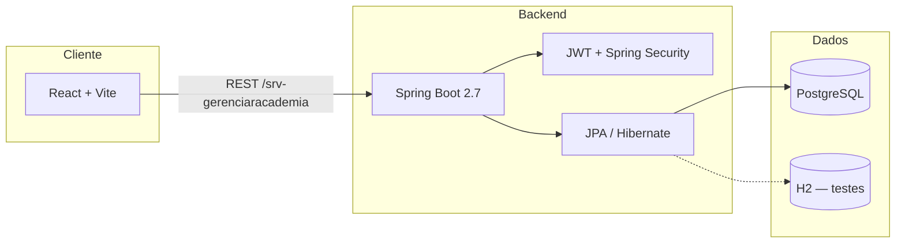

# Arquitetura do repositório

Monorepo **EduGestão Inteligente** — gestão de instituições de ensino (colaboradores, alunos, turmas, financeiro, portal do aluno).

## Visão geral

## Pastas na raiz

| Pasta | Responsabilidade |
|-------|------------------|
| `backend/` | API REST, domínio, segurança, certificados |
| `frontend/` | SPA React, rotas, auth no cliente |
| `docs/` | Roadmap, deploy, migrações SQL, testes |
| `infra/` | Imagens e init do PostgreSQL (`infra/docker/`) |
| `scripts/` | Automação de portas, subida Docker, URL pública |

Arquivos Compose (`docker-compose*.yml`), `.env` e `subir.bat` ficam na raiz para uso direto com `docker compose`.

## Backend (`gerenciamentoDeAcademia`)

Pacote base Java: `gerenciamentoDeAcademia` (evolução gradual do nome histórico do projeto).

| Pacote | Papel |
|--------|--------|
| `controller` | Endpoints REST (`/login`, `/instituicao`, portal, financeiro, …) |
| `servicos` | Regras de negócio e orquestração |
| `entidades` / `repositorios` | Modelo JPA e persistência |
| `dto` / `enums` | Contratos API e tipos de domínio |
| `excecao` | Erros de aplicação (`ApplicationException`) |
| `infra` | **Infraestrutura da aplicação**: segurança (JWT, filtros), Swagger, inicializadores de dados |
| `util` / `utils` | Helpers (consolidação futura em um único pacote) |

Context path da API: `/srv-gerenciaracademia` (mantido por compatibilidade com deploys existentes).

Perfis Spring: `local` (PostgreSQL host), `docker` (stack Compose), `h2` (memória).

## Frontend

| Área | Papel |
|------|--------|
| `src/auth/` | Permissões, menu por perfil |
| `src/services/` | Cliente HTTP (`HttpService`), integrações |
| `src/components/` | UI por domínio (login, acadêmico, financeiro, …) |
| `src/pages/` | Páginas de rota (portal aluno, auditoria, plano, …) |
| `src/constants/` | Branding (`EduGestão Inteligente`, termos “instituição”) |

Autenticação: JWT no `localStorage`, guards (`ProtectedRoute`, `PlanoInstituicaoGuard`), interceptor de cobrança pós-login.

## Segurança e login (estado atual)

- Login por CPF + vínculo (instituição) + senha; listagem de vínculos em `GET /login/vinculos/{cpf}`.
- Perfis de colaborador (`TipoFuncionario`) com `@PreAuthorize` e permissões no token.
- Portal do aluno no mesmo fluxo de autenticação, escopo por instituição.
- Recuperação de senha: endpoint aceita solicitação; **envio de e-mail ainda não implementado** (ver roadmap).
- Cobrança: claims de situação no JWT, tolerância de 5 dias, bloqueio após prazo.

## Próxima fase (refatoração)

Foco em **login / cadastro / infra** sem quebrar contratos públicos da API:

1. Consolidar fluxos de tela (login, cadastro, solicitar acesso, esqueci senha).
2. Serviço de e-mail e fluxo real de recuperação de senha.
3. Política de senha, MFA e rate limiting (backend + `infra` de deploy).
4. Renovação de JWT após ativar plano da instituição (sem logout manual).
5. Documentar e, quando possível, unificar pacotes `util`/`utils` no backend.

Detalhes e prioridades: [ROADMAP.md](./ROADMAP.md).
