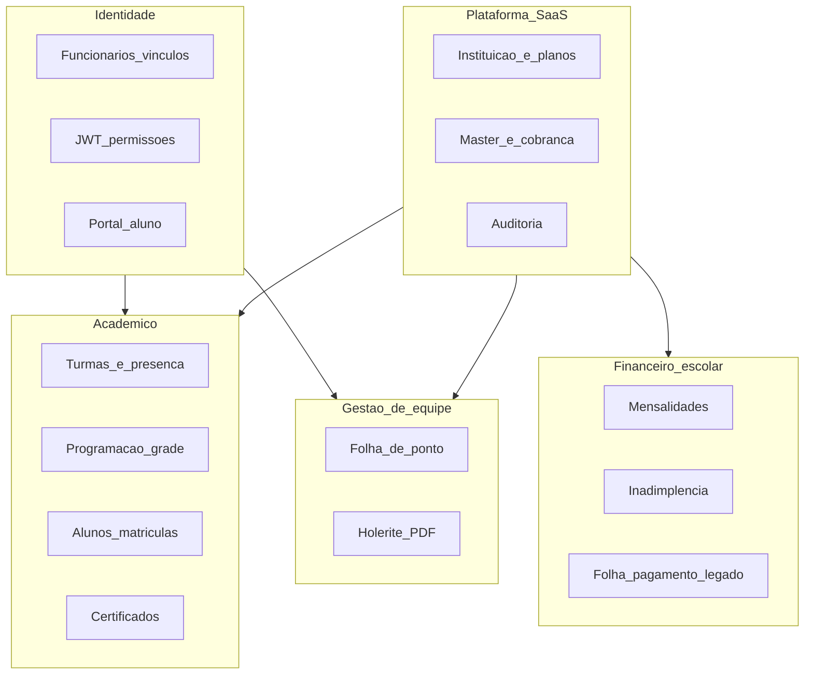

# Bounded contexts — backend Turma360

Mapa lógico do monorepo Java (`gerenciamentoDeAcademia`). Pacotes físicos ainda unificados; evolução futura (Onda B) pode alinhar pastas a estes contextos.

## Contextos e pacotes atuais

| Contexto | Responsabilidade | Pacotes / controllers principais |
|----------|------------------|----------------------------------|
| **Identidade** | Login, JWT, funcionários, perfil | `controller/Login*`, `Funcionario*`, `infra/seguranca` |
| **Plataforma** | Multi-tenant, planos, master | `servicos/master`, `Instituicao*`, `PlanoInstituicao*` |
| **Acadêmico** | Turmas, alunos, programação, presença | `servicos/turma`, `servicos/programacao`, `Aluno*` |
| **Financeiro escolar** | Mensalidades, inadimplência | `servicos/financeiro`, `Financeiro*` |
| **Financeiro legado** | Folha interna, conciliação (congelado) | `FolhaPagamento*`, `Conciliacao*` |
| **Gestão de equipe** | Ponto, holerite PDF | `RhFolhaPonto*`, `RhRemuneracao*`, `Colaborador*` |
| **Portal aluno** | Self-service aluno | `PortalAluno*` |

## Frontend espelhado

| Módulo API (`frontend/src/services/api/`) | Domínio |
|-------------------------------------------|---------|
| `authApi` | Autenticação |
| `instituicaoApi` | Instituição e planos |
| `funcionarioApi` | Colaboradores |
| `alunoApi` | Alunos |
| `turmaApi` | Turmas e presença |
| `programacaoApi` | Grade horária |
| `financeiroApi` | Financeiro escolar + legado |
| `equipeApi` | Ponto e documentos PDF |
| `portalAlunoApi` | Portal do aluno |
| `plataformaApi` | Dashboard, certificados, auditoria |

## Regras de dependência (alvo)

- Acadêmico **não** depende de Financeiro legado.
- Gestão de equipe **não** calcula folha; apenas armazena PDF.
- Portal aluno **só** lê dados do contexto Acadêmico + Mensalidades.
