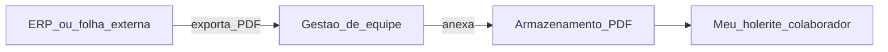

# Escopo do produto — Turma360

SaaS de gestão para **instituições de ensino híbridas**: cursos livres, esportes, idiomas e escolas menores. Posicionamento: operação pedagógica e financeira leve — **não** ERP completo nem folha de pagamento integrada.

## Marca

| Item | Valor |
|------|--------|
| Nome comercial | **Turma360** |
| Domínio alvo | `turma360.com.br` (validar no Registro.br) |
| Tagline | Gestão completa da sua instituição, em um só lugar |
| Pacotes técnicos (onda B) | Renomear após domínio confirmado |

## Matriz de módulos

| Módulo | Decisão | Observação |
|--------|---------|------------|
| Turmas e matrículas | **Manter** | Core do produto |
| Programação / grade horária | **Manter** | Diferencial operacional |
| Presença e portal do aluno | **Manter** | |
| Financeiro (mensalidades, inadimplência) | **Manter** | Foco em cobrança escolar |
| Conciliação bancária | **Removido da UI** | Não faz parte do produto |
| Folha de pagamento interna | **Removido da UI** | Valores vêm de ERP externo |
| Fechamento de mês / caixa | **Removido da UI** | Fora do escopo SaaS leve |
| Folha de ponto | **Manter (leve)** | Marcação e conferência; sem virar RH pesado |
| Holerite e recibo | **Simplificar** | **Anexo de PDF** gerado no ERP/sistema externo |
| Férias colaborador | **Manter (leve)** | Solicitação e aprovação simples |
| Certificados | **Manter** | |
| Multi-instituição / planos SaaS | **Manter** | Modelo de negócio |
| Auditoria e permissões | **Manter** | |

## Gestão de equipe (ex-RH)

Na interface, o bloco **Recursos Humanos** passa a **Gestão de equipe**.

Funcionalidades mantidas:

- Folha de ponto (colaborador marca; gestor confere)
- Fechamento mensal de ponto
- Férias

Holerite e recibo — modelo alvo:

1. RH/gestor seleciona colaborador, mês/ano e **anexa PDF** (holerite e/ou recibo exportados do ERP).
2. Colaborador visualiza e baixa em **Meu holerite**.
3. Sem cálculo de salário, INSS, IRRF ou integração contábil no Turma360.

## Fora de escopo (deliberado)

- Folha de pagamento completa
- eSocial, DIRF, contabilidade
- Conciliação bancária avançada como produto principal
- Competir com suites ERP educacionais de grande porte

## Integrações planejadas (produção)

| Provedor | Função |
|----------|--------|
| **Asaas** | Mensalidade aluno→instituição; plano instituição→plataforma |
| **Brevo** | E-mail transacional |
| **Twilio** | WhatsApp |

Modo local documentado em [INTEGRACOES.md](./INTEGRACOES.md). Deploy futuro: [DEPLOY_VPS.md](./DEPLOY_VPS.md).

## Referências internas

- [REFATORACAO_ETAPAS.md](./REFATORACAO_ETAPAS.md) — plano de execução por etapas
- [FOLHA_PONTO.md](./FOLHA_PONTO.md) — ponto e publicação de documentos
- [ROADMAP.md](./ROADMAP.md) — prioridades de entrega
- [BENCHMARK_MERCADO.md](./BENCHMARK_MERCADO.md) — posicionamento de mercado
