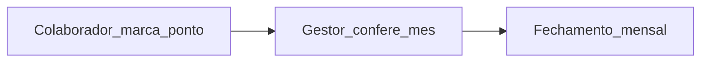
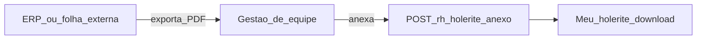

# Folha de ponto e documentos da equipe — Turma360

Marcação de entrada/saída pelo colaborador, conferência pela gestão de equipe e entrega de holerite/recibo via **PDF anexado** (exportado do ERP ou sistema de folha externo).

## Folha de ponto (mantém)

| Etapa | Quem | Onde no sistema |
|-------|------|-----------------|
| 1 | Colaborador | Área do colaborador → **Meu ponto** |
| 2 | Gestão de equipe | **Folha de ponto** → Conferir |
| 3 | Gestão de equipe | **Fechamento mensal** |

### Regras de negócio (ponto)

- Uma marcação por dia: **entrada** e depois **saída**.
- Registros em aberto (entrada sem saída) impedem a conferência.
- Após conferir o mês, novas marcações do colaborador ficam bloqueadas na competência.

### APIs (ponto)

| Endpoint | Perfil |
|----------|--------|
| `GET/POST /colaborador/folha-ponto/*` | Qualquer colaborador autenticado |
| `GET/POST /rh/folha-ponto/*` | `rh:folha-ponto` |

### Entidades (ponto)

- `tb_registro_dia_ponto` — entrada/saída por colaborador e dia
- `tb_conferencia_ponto_mensal` — conferência mensal

---

## Holerite e recibo (modelo alvo — PDF)

O Turma360 **não calcula folha de pagamento**. O gestor anexa o holerite e/ou recibo em PDF gerados no ERP ou sistema externo.

| Etapa | Quem | Onde no sistema |
|-------|------|-----------------|
| 1 | Gestão de equipe | **Anexar holerite / recibo (PDF)** — colaborador, mês/ano, arquivo |
| 2 | Colaborador | **Meu holerite** — visualizar e baixar PDF |

### Regras (documentos)

- Apenas arquivos **PDF**; um ou dois anexos por competência (holerite e recibo).
- Sem integração contábil, eSocial ou cálculo de salário no Turma360.
- Substitui o fluxo legado de “publicar holerite” sem arquivo.

### API (documentos PDF)

| Endpoint | Perfil |
|----------|--------|
| `POST /rh/remuneracao/holerite/anexo` (multipart) | `rh:holerite-lancamento` |
| `GET /colaborador/documentos-remuneracao/{id}/pdf` | Colaborador autenticado |

Arquivos persistidos em `app.remuneracao.documentos.base-path` (volume Docker `remuneracao_docs_data`).

---

## Legado (congelar)

A integração **Financeiro → Folha de pagamento → Integrar folha de ponto** permanece no código por compatibilidade, mas **não será expandida**. Novas instituições devem usar holerite via PDF externo. Ver [ESCOPO_PRODUTO.md](./ESCOPO_PRODUTO.md).

## Próximos passos

- Implementar upload/download de PDF no holerite
- Relógio externo / importação CSV de ponto
- Banco de horas e ajustes manuais com justificativa (opcional)

Roteiro de teste: [CENARIOS_TESTE.md](./CENARIOS_TESTE.md) (seção Folha de ponto).
