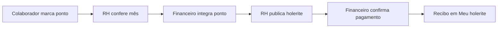

# Folha de ponto

Marcação de entrada/saída pelo colaborador, conferência pelo RH e integração com o Financeiro na folha de pagamento.

## Fluxo integrado

| Etapa | Quem | Onde no sistema |
|-------|------|-----------------|
| 1 | Colaborador | Área do colaborador → **Meu ponto** |
| 2 | RH | Recursos Humanos → **Folha de ponto** → Conferir |
| 3 | Financeiro | Financeiro → **Folha de pagamento** → Integrar folha de ponto |
| 4 | RH | Recursos Humanos → **Lançamento de holerite** |
| 5 | Financeiro | Financeiro → **Folha de pagamento** → Confirmar pagamento |
| 6 | Colaborador | **Meu holerite** (holerite + recibo) |

## Regras de negócio

- Uma marcação por dia: **entrada** e depois **saída**.
- Registros em aberto (entrada sem saída) impedem a conferência do RH.
- Após o RH conferir o mês, novas marcações do colaborador ficam bloqueadas na competência.
- Pagamentos só são confirmados se o ponto foi **conferido pelo RH** e **integrado pelo Financeiro**.
- O holerite publicado inclui horas apuradas do ponto.

## APIs (backend)

| Endpoint | Perfil |
|----------|--------|
| `GET/POST /colaborador/folha-ponto/*` | Qualquer colaborador autenticado |
| `GET/POST /rh/folha-ponto/*` | `rh:folha-ponto` |
| `GET/POST /financeiro/folha-pagamento/ponto/*` | `financeiro:cobranca` |

## Entidades

- `tb_registro_dia_ponto` — entrada/saída por colaborador e dia
- `tb_conferencia_ponto_mensal` — conferência RH e integração financeiro

## Próximos passos

- Relógio externo / importação CSV
- Banco de horas, extras e adicional noturno
- Ajustes manuais pelo RH com justificativa
- Reconhecimento facial (fora do escopo atual)

Roteiro de teste: [CENARIOS_TESTE.md](./CENARIOS_TESTE.md) (seção Folha de ponto).
