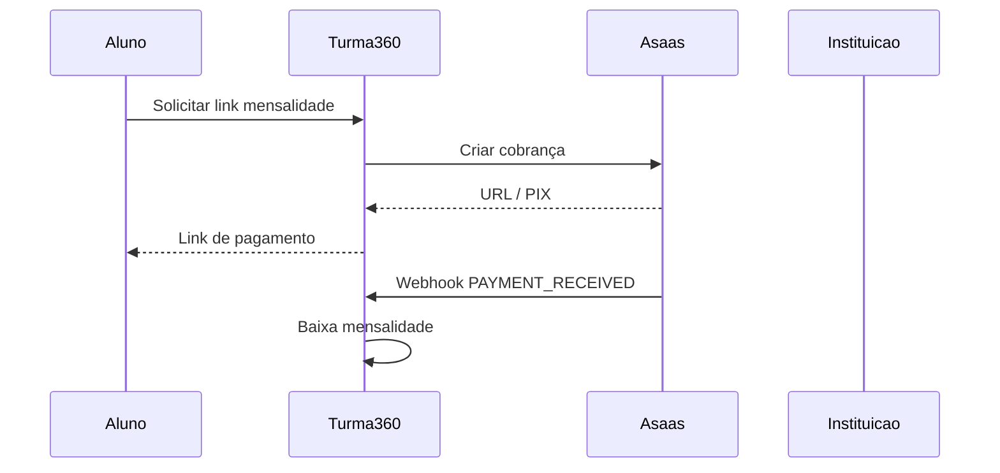

# Integrações externas — Turma360

Provedores definidos para produção; em **desenvolvimento local** o sistema usa modo simulado (sem chaves reais).

| Provedor | Uso | Variáveis `.env` |
|----------|-----|------------------|
| **Brevo** | E-mail transacional (recuperação de senha, avisos) | `BREVO_ENABLED`, `BREVO_API_KEY`, `BREVO_SENDER_EMAIL` |
| **Twilio** | WhatsApp (cobrança, lembretes) | `TWILIO_ENABLED`, `TWILIO_ACCOUNT_SID`, `TWILIO_AUTH_TOKEN`, `TWILIO_WHATSAPP_FROM` |
| **Asaas** | PIX/boleto/cartão — mensalidade aluno→instituição e plano instituição→plataforma | `ASAAS_ENABLED`, `ASAAS_API_KEY`, `ASAAS_WEBHOOK_TOKEN` |

## Fluxos de pagamento (Asaas)

| Tipo | Quem paga | Quem recebe | Endpoint Turma360 |
|------|-----------|-------------|-------------------|
| `MENSALIDADE_ALUNO` | Aluno | Instituição | `POST /portal-aluno/cobranca/mensalidade` |
| `PLANO_INSTITUICAO` | Instituição | Plataforma Turma360 | `POST /plano-instituicao/{id}/cobranca` |

Webhook: `POST /webhooks/asaas` (header `asaas-access-token` = `ASAAS_WEBHOOK_TOKEN`).

## Modo local (sem credenciais)

Com `APP_INTEGRACOES_MODO_LOCAL=true` (padrão em dev):

- E-mail e WhatsApp são **registrados no log** do backend (não enviam).
- Cobrança Asaas gera registro em `tb_cobranca_externa` com URL simulada.
- `POST .../cobranca/{id}/simular-pagamento` confirma o pagamento para testes.

## Teste manual local

1. Suba a stack (`subir.bat`).
2. Login como aluno → **Mensalidades** → **Gerar link de pagamento (teste)**.
3. **Simular pagamento confirmado** — mensalidade deve aparecer em dia.
4. Recuperação de senha: ver log `NOTIFICACAO_EMAIL` no backend.

## Produção (VPS)

Ver [DEPLOY_VPS.md](./DEPLOY_VPS.md). Configure chaves no `.env` da VPS de aplicação e `APP_INTEGRACOES_MODO_LOCAL=false`.
